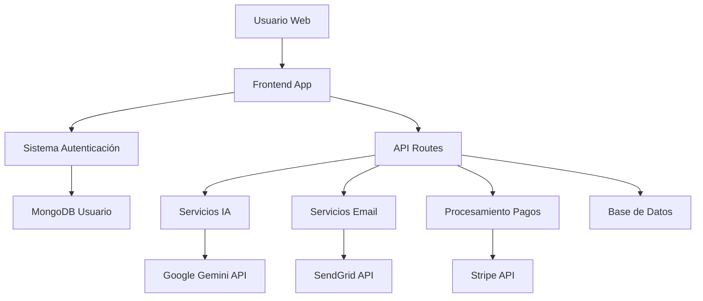

# Documentación Técnica de Compliance - Producto Frontend Reversa

## 1) Resumen Ejecutivo

Reversa Frontend es una aplicación web que proporciona interfaz de usuario para el análisis de documentos oficiales mediante Inteligencia Artificial. La aplicación permite a los usuarios gestionar perfiles personalizados, configurar etiquetas de seguimiento normativo, y acceder a análisis de impacto regulatorio.

**Datos Personales Procesados:**
- Datos de identificación: email, nombre, información profesional
- Resumen sobre actividad económica realizada (2-3 párrafos descriptivos de actividad empresarial)
- Áreas de interés regulatorio: etiquetas personalizadas sobre materias específicas (ej: "Subvenciones I+D")
- Datos de suscripción: plan contratado, modalidad de pago
- Configuración de cuenta: preferencias de fuentes y notificaciones
- Feedback de usuario: comentarios para mejora personalizada del servicio

**Finalidades del Tratamiento:**
- Autenticación y gestión de cuentas de usuario
- Personalización del servicio según áreas de interés regulatorio declaradas
- Facturación mediante pago intraplataforma (usuarios/pequeñas empresas) o transferencia bancaria (enterprise)
- Orientación de respuestas mediante información pública de actividad económica (herramienta de asistencia)
- Mejora personalizada opcional del servicio mediante feedback específico del usuario
- Automatización de tareas de seguimiento normativo (con monitoreo y corrección humana cuando sea necesario)
- Comunicaciones relacionadas con el servicio

## 2) Arquitectura del Sistema

## 3) Componentes Funcionales

### Gestión de Usuarios y Autenticación
- **Registro/Login**: Autenticación local con email/contraseña usando Passport.js
- **Seguridad**: Contraseñas hasheadas con bcrypt (factor 10)
- **Sesiones**: Almacenamiento seguro en MongoDB con MongoStore
- **Cookies**: Cookie de usuario para acceso frontend (no httpOnly por necesidades UX)

### Procesamiento de Datos con IA
- **Generación de Perfiles**: Análisis de información pública de actividad económica para orientar respuestas
- **Agentes Personalizados**: Creación de agentes basados en áreas de interés regulatorio declaradas
- **Análisis de Sitios Web**: Extracción automática de información de páginas web públicas (con consentimiento)
- **Sistema de Feedback**: Mejora personalizada mediante comentarios específicos del usuario

### Sistema de Feedback Personalizado
- **Finalidad**: Mejora exclusiva de la experiencia del usuario individual
- **Datos Utilizados**: Comentarios y evaluaciones proporcionados voluntariamente
- **Uso Específico**: Afinar y reescribir descripciones de agentes según intereses del usuario
- **Garantía Clave**: NUNCA se utiliza para entrenar sistemas de manera general
- **Beneficio**: Personalización progresiva del servicio para cada cuenta individual
- **Supervisión Humana**: Herramienta monitoreada que permite intervención cuando es necesario

### Gestión de Suscripciones
- **Planes de Servicio**: Múltiples niveles con diferentes límites de uso
- **Pago Intraplataforma**: Para usuarios individuales y pequeñas empresas mediante Stripe
- **Facturación Enterprise**: Transferencia bancaria con soporte comercial personalizado
- **Transparencia**: Información completa sobre Política de Privacidad en registro

## 4) Uso de Inteligencia Artificial y Transferencias de Datos

### Modelos de IA Utilizados

**Google Gemini 1.5 Pro:**
- **Finalidad**: Generación de perfiles regulatorios y agentes personalizados (herramienta de asistencia)
- **Configuración**: Respuestas en formato JSON, temperatura 0.7
- **Enfoque**: Human on the loop (supervisión y corrección cuando es necesario)
- **Limitaciones**: No proporciona asesoramiento legal, solo automatización de tareas

**OpenAI API:**
- **Finalidad**: Procesamiento de documentos oficiales públicos para generación de resúmenes e identificación de impacto
- **Configuración**: Modelos optimizados para análisis de texto normativo
- **Enfoque**: Human on the loop (supervisión y corrección cuando es necesario)
- **Limitaciones**: No proporciona asesoramiento legal, solo análisis automatizado de documentos públicos

### Datos Enviados a Proveedores de IA

**A Google Gemini API se envía únicamente información proporcionada voluntariamente por el usuario:**
- Resumen sobre actividad económica (2-3 párrafos descriptivos de actividad empresarial pública)
- Definiciones de los agentes IA proporcionadas por los usuarios para poder automatizar la búsqueda normativa por ellos. En ellas definen las áreas de interés regulatorio específicas (ej: "Subvenciones relacionadas con I+D") y en la definición establecen más detalle sobre las cosas relevantes para ellos (ej: "Solo notifícame de subvenciones del ayuntamiento de Madrid") 
- Contenido extraído de páginas web públicas (cuando autorizado por el usuario)

**A OpenAI API se envía únicamente información pública oficial:**
- Contenido completo de documentos oficiales publicados en fuentes públicas (BOE, CNMV, reguladores)
- Texto de normativas, resoluciones y documentos regulatorios de acceso público
- Metadatos básicos de documentos (fecha, fuente, tipo de documento)

**NO se envían a ningún proveedor de IA:**
- Emails de usuarios, contraseñas, información de pago, datos identificativos
- Información confidencial o privada de empresas
- Datos personales más allá de áreas de interés declaradas voluntariamente

**IMPORTANTE - Datos No Confidenciales:**
- Solo se procesan datos que el usuario proporciona voluntariamente para mejorar el servicio
- La información consiste únicamente en descripciones generales de actividad económica pública
- Las etiquetas personalizadas son áreas de interés regulatorio (no datos sensibles)
- **NUNCA se usan datos del usuario para entrenar modelos generales**

### Garantías de Transferencia
- **Base Legal**: Consentimiento específico e informado del usuario para cada uso
- **Principio de Minimización**: Solo datos estrictamente necesarios para orientar respuestas
- **Uso Exclusivo**: Datos utilizados únicamente para configuración de cuenta individual
- **Sin Entrenamiento**: Los datos NO se utilizan para entrenar sistemas de IA generales
- **Medidas**: Comunicaciones cifradas HTTPS, controles de cuota
- **Transferencias Internacionales**: Aplicación de cláusulas contractuales tipo según corresponda

## 5) Tratamiento de Datos Personales

### Categorías de Datos
**Datos de Identificación:**
- Email (requerido para registro)
- Nombre y apellidos (opcional)
- Información profesional (perfil, especialización)

**Resumen sobre Actividad Económica:**
- Descripción general de actividad empresarial (2-3 párrafos de información pública)
- Sector de actividad (información no confidencial)
- Tipo y tamaño de empresa (categorización general)
- Página web corporativa (información pública)

**Agentes de IA /Etiquetas personalizadas**
- Etiquetas de materias específicas (ej: "Subvenciones I+D", "Normativa Laboral")
- Fuentes regulatorias de seguimiento preferidas
- Rangos normativos de interés
- Configuración de cobertura legal personalizada

**Datos de Feedback:**
- Comentarios del usuario sobre funcionamiento del servicio
- Sugerencias de mejora específicas para su cuenta
- Evaluaciones de utilidad de agentes personalizados
- **Uso exclusivo**: Mejora personalizada, NO para entrenamiento general

**Datos de Suscripción:**
- Plan contratado
- Información de facturación solo para cuentas de usuarios y pequeñas empresas (procesada por Stripe). Planes enterprise tienen facturación bancaria con soporte del equipo comercial por fuera de la plataforma

### Bases Legales
- **Ejecución de contrato**: Gestión de cuenta y prestación del servicio básico
- **Consentimiento específico**: Uso de resumen de actividad económica para orientar respuestas IA
- **Consentimiento informado**: Análisis de sitios web públicos cuando autorizado
- **Consentimiento para feedback**: Uso de comentarios para mejora personalizada del servicio
- **Interés legítimo**: Mejora técnica del servicio y prevención de fraude

### Información al Usuario
- **Registro**: Política de Privacidad completa disponible y revisable durante el alta
- **Transparencia Total**: Explicación clara sobre qué datos se usan y para qué
- **Control Usuario**: Decisión voluntaria sobre qué información proporcionar, según el grado de personalización que se quiera alcanzar

### Derechos del Usuario
La aplicación facilita el ejercicio de derechos RGPD mediante:
- **Acceso**: API `/api/get-user-data` para obtener datos del usuario
- **Rectificación**: API `/api/update-user-data` para modificar datos
- **Supresión**: Posibilidad de eliminar cuenta dentro de la app o de ontacto directo para su eliminación

## 6) Medidas de Seguridad Técnicas

### Autenticación y Autorización
- Middleware `ensureAuthenticated` en todas las rutas protegidas
- Validación de contraseñas
- Sesiones con expiración automática (14 días)
- Protección CSRF mediante configuración de cookies

### Cifrado y Protección
- **Comunicaciones**: HTTPS obligatorio en producción
- **Contraseñas**: Hash bcrypt con salt aleatorio
- **Sesiones**: Almacenamiento seguro en MongoDB
- **Cookies**: Configuración segura con flags httpOnly y secure

### Control de Acceso
- Verificación de identidad en cada request autenticado
- Segregación de datos por usuario mediante ObjectId
- Validación de entrada en todos los endpoints
- Rate limiting implícito mediante arquitectura de aplicación

## 7) Cookies y Tracking

### Cookies Propias Técnicas
**`connect.sid` (Cookie de Sesión):**
- **Finalidad**: Mantener la sesión del usuario autenticado
- **Duración**: 14 días (configurable)
- **Seguridad**: httpOnly=true, secure=true (producción), sameSite según entorno
- **Almacenamiento**: MongoDB con MongoStore
- **Base Legal**: Estrictamente necesaria (exención RGPD Art. 5.3)

**`userEmail` (Cookie de Identificación):**
- **Finalidad**: Posibilitar msotrar la cuenta de usuario y sus datos (agentes, fuentes seleccionadas...)
- **Duración**: 24 horas
- **Características**: httpOnly=false (necesario para acceso JavaScript)
- **Seguridad**: secure=true (producción), sameSite según entorno
- **Base Legal**: Técnicamente necesaria para funcionamiento del servicio

### Configuración Técnica
- **Producción**: secure=true, sameSite='none' para compatibilidad cross-domain
- **Desarrollo**: secure=false, sameSite='lax' para desarrollo local
- **Proxy Trust**: Configurado para headers correctos detrás de proxy (Render)

## 8) Procesamiento de Pagos

### Modalidades de Pago

**Pago Intraplataforma (Usuarios y Pequeñas Empresas):**
- **Procesador**: Stripe (PCI DSS nivel 1)
- **Datos Procesados**: Información de tarjeta procesada directamente por Stripe
- **Almacenamiento Local**: Solo IDs de sesión y customer de Stripe
- **Base Legal**: Ejecución de contrato

**Facturación Enterprise:**
- **Modalidad**: Transferencia bancaria
- **Gestión**: Soporte y supervisión del equipo comercial
- **Datos**: Solo información de facturación empresarial estándar
- **Base Legal**: Ejecución de contrato comercial

### Datos de Facturación
- Almacenamiento mínimo: plan, precio, fecha de suscripción, modalidad de pago
- No se almacenan datos de tarjeta en servidores propios
- Sincronización con webhooks de Stripe para pagos intraplataforma

## 9) Servicios de Email

### Proveedor SendGrid
- **Finalidad**: Envío de emails transaccionales (confirmación, reset password)
- **Datos Enviados**: Email del usuario, nombre (si proporcionado), detalles de suscripción
- **Retención**: Según política de SendGrid (30 días para logs)
- **Base Legal**: Ejecución de contrato

### Tipos de Comunicaciones
- **Confirmación de suscripción**: Datos del plan y configuración
- **Reset de contraseña**: Token temporal con expiración 1 hora
- **Notificaciones transaccionales**: Cambios en cuenta o suscripción
- **Alertas de configuración**: Notificaciones sobre novedades normativas detectadas por agentes personalizados

## 10) Contacto 

### Responsable del Tratamiento
**Reversa Legal**
- Email genérico de soporte: info@reversa.ai
- Responsable comercial y de atención al cliente: tomas@reversa.ai

### Encargados del Tratamiento
- **Google LLC**: Procesamiento IA (Gemini) - Solo información pública de actividad económica y áreas de interés
- **OpenAI Inc.**: Procesamiento de documentos oficiales públicos para generación de resúmenes e impacto
- **SendGrid (Twilio)**: Servicios de email
- **Stripe**: Procesamiento de pagos intraplataforma
- **MongoDB Atlas**: Hosting de base de datos (si aplicable)

## 12) Proveedores de Servicios y Infraestructura

### Proveedores Principales

**MongoDB Inc. (Base de Datos):**
- **Servicio**: MongoDB Atlas (Base de datos como servicio)
- **Datos Almacenados**: Todos los datos de usuario y aplicación
- **Ubicación**: Servidores en región seleccionada (configuración europea disponible)
- **Certificaciones**: SOC 2 Type II, ISO 27001, GDPR compliance
- **Medidas de Seguridad**: Cifrado en reposo y en tránsito, control de acceso basado en roles

**Stripe Inc. (Procesamiento de Pagos):**
- **Servicio**: Procesamiento de tarjetas de crédito y gestión de suscripciones
- **Datos Procesados**: Información de pago para usuarios y pequeñas empresas
- **Certificaciones**: PCI DSS Level 1, SOC 2 Type II
- **Ubicación**: Global con centros de datos en Europa
- **Garantías**: Strong Customer Authentication (SCA), 3D Secure 2.0
- **Retención**: Según normativa PCI DSS y requisitos regulatorios

**SendGrid (Twilio Inc.) (Servicios de Email):**
- **Servicio**: Envío de emails transaccionales
- **Datos Procesados**: Direcciones de email, contenido de mensajes transaccionales
- **Certificaciones**: SOC 2 Type II, ISO 27001
- **Retención**: Logs de email 30 días, según política de SendGrid
- **Ubicación**: Centros de datos globales con opciones de región EU

**Render Services Inc. (Hosting y Infraestructura):**
- **Servicio**: Hosting de aplicación web y servicios
- **Datos Almacenados**: Código de aplicación, logs de sistema
- **Certificaciones**: SOC 2 Type II, conformidad GDPR
- **Ubicación**: Centros de datos en Frankfurt (EU)
- **Medidas**: Cifrado TLS 1.3, aislamiento de contenedores, monitoreo 24/7
- **Backup**: Snapshots automáticos y redundancia de datos

**Google LLC (Servicios de IA):**
- **Servicio**: Google Gemini 1.5 Pro API
- **Datos Procesados**: Solo información empresarial pública y áreas de interés
- **Ubicación**: Centros de datos globales de Google
- **Garantías**: No entrenamiento con datos del cliente, procesamiento temporal
- **Certificaciones**: ISO 27001, SOC 2, conformidad GDPR
- **Contratos**: Terms of Service y Data Processing Agreement

**OpenAI Inc. (Procesamiento de Documentos Oficiales):**
- **Servicio**: OpenAI API para procesamiento de documentos oficiales
- **Finalidad**: Generación de resúmenes e identificación de impacto de documentos públicos normativos
- **Datos Procesados**: Contenido de documentos oficiales públicos (BOE, CNMV, reguladores)
- **Ubicación**: Centros de datos de OpenAI (Estados Unidos)
- **Garantías**: No entrenamiento con datos específicos del cliente, procesamiento temporal
- **Certificaciones**: SOC 2 Type II, conformidad con estándares de seguridad
- **Contratos**: Business Agreement y Data Processing Addendum

## 11) Resumen de Garantías de Seguridad Empresarial

### Sistema Seguro que NO Compromete Datos Empresariales

**Principios Fundamentales:**
- **Minimización Extrema**: Solo se usan datos que el usuario proporciona voluntariamente
- **Información No Confidencial**: Únicamente descripciones públicas de actividad económica
- **Sin Entrenamiento**: Los datos NUNCA se usan para entrenar modelos generales
- **Uso Individual**: Datos utilizados exclusivamente para configuración de cada cuenta
- **Control Total**: El usuario decide qué información proporcionar en todo momento

**Tipos de Información Procesada:**
- **Actividad Económica**: 2-3 párrafos descriptivos de actividad empresarial pública
- **Áreas de Interés**: Etiquetas sobre materias regulatorias (ej: "Subvenciones I+D")
- **Feedback**: Comentarios voluntarios para mejora personalizada del servicio
- **Información Web**: Solo contenido público de páginas web (con autorización)

**Datos no procesados:**
- Información confidencial o delicada. Datos de entrada siempre bajo decisión del usuario y su propia responsabilidad
- Datos comerciales sensibles
- Información interna de la empresa
- Datos para entrenamiento de IA general
- Información identificativa más allá del email de cuenta

**Garantía de Privacidad Empresarial:**
El sistema está diseñado específicamente para NO comprometer la seguridad empresarial, utilizando únicamente información pública y áreas de interés que el usuario declara voluntariamente para recibir un servicio más personalizado y relevante.

## 13) Casos de Uso Excluidos y Limitaciones Éticas de IA

###  Casos de Uso NO Implementados

**Reconocimiento Biométrico:**
-  No se procesa información biométrica de ningún tipo
-  No hay identificación facial, dactilar o de voz
-  No se almacenan características físicas identificativas
-  No hay sistemas de autenticación biométrica

**Aplicaciones de Defensa y Seguridad:**
-  No hay análisis para aplicaciones militares
-  No se procesa información de seguridad nacional
-  No hay sistemas de vigilancia o monitoreo de personas
-  No se realiza análisis de amenazas o riesgos de seguridad

**Interacciones con el Mundo Físico:**
-  No hay control de dispositivos físicos o maquinaria
-  No se realizan recomendaciones que puedan afectar la seguridad física
-  No hay integración con sistemas de transporte o infraestructura crítica
-  No se proporcionan instrucciones para actividades que impliquen riesgo físico

**Otros Casos Problemáticos:**
-  No hay categorización de personas por características protegidas
-  No se realizan evaluaciones de solvencia crediticia o scoring
-  No hay análisis predictivo sobre comportamiento humano
-  No se procesa información de menores de edad
-  No hay sistemas de toma de decisiones automatizadas que afecten derechos fundamentales
-  No se realizan análisis psicológicos o de salud mental

### Enfoque Responsable y Human on the Loop

**Principio de Monitoreo Humano:**
- **Herramienta Automatizada**: El sistema funciona de manera autónoma pero está diseñado para permitir intervención humana cuando sea necesario
- **Human on the Loop**: Los usuarios actúan como monitores que pueden intervenir para corregir errores o manejar excepciones
- **No Asesoramiento Legal**: El sistema NO proporciona consejos legales, solo organiza y presenta información
- **Análisis de Apoyo**: Facilita la revisión automatizada de documentos normativos, con posibilidad de intervención humana para interpretación

**Limitaciones y Responsabilidades:**
- El usuario mantiene total responsabilidad sobre las decisiones tomadas basadas en los resultados del sistema
- Los resultados de IA son procesamiento automatizado que puede requerir corrección o validación profesional
- No se sustituye el criterio experto en materias legales o regulatorias
- El sistema es una herramienta de automatización con supervisión, no un sustituto profesional

**Monitoreo y Control:**
- Control total del usuario sobre la configuración y uso del sistema
- Capacidad de intervenir en cualquier momento para corregir o ajustar resultados
- Transparencia completa sobre el funcionamiento de los algoritmos
- Posibilidad de desactivar o modificar cualquier funcionalidad de IA según necesidades
- Acceso completo a los datos y procesos utilizados para permitir supervisión efectiva

---

*Documento actualizado: Enero 2025*
*Versión: 1.3*
*Revisión próxima: Julio 2025*
